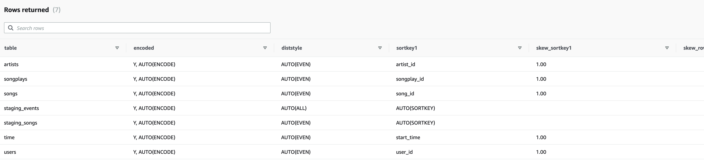

# Sparkify Redshift Data Warehouse

* This project sets up a Redshift cluster (using Infrastructure as Code), set ups Staging and Analytics tables and performs the ETL tasks to load the data into the tables from json files in S3 buckets.

## Running the code

### Setting up the Redshift cluster
* Assuming you have a *credentials.yaml* file with the following values:
```yaml
KEY: <AWS KEY>
SECRET: <AWS SECRET>
```

 Then you can set up the Redshift cluster in your AWS workspace by running:

 ```bash
$ python3 iac_redshift.py
 ```

### Creating the Tables

* To create the Staging and Analytic tables run:

```bash
$ python3 create_tables.py
```

### Running the ETL process

* To load the data into the tables, run:
```bash
$ python3 etl.py
```

## Table Definitions

* Redshift does not enforce primary and foriegn key constraints but uses them for query optimizations. Therefore I have defined primary and foriegn keys for tables where appropriate.

    [Redshift Table Constraints Documentation](https://docs.aws.amazon.com/redshift/latest/dg/c_best-practices-defining-constraints.html)

* For this exercise the default distribution behaviour provided by redshift was sufficient. Redshift uses the Primary keys as sort keys (if not specified) and defaults to an **auto** distribution style.

    

## Dashboard

Once the data has been loaded into the cluster, you can visualize some of the data using the following jupyter notebook.

The [Dashboard](dashboard.ipynb) can be viewed using Jupyter notebooks with the necessary dependencies installed (pandas, plotly, psycopg2, chart-studio).
  

### Plotly Mapbox plot of Artist Locations
    
* To see a stored copy of the artist location visualization, click on the following link

     [Artist Locations Plot](images/artist-location.png)